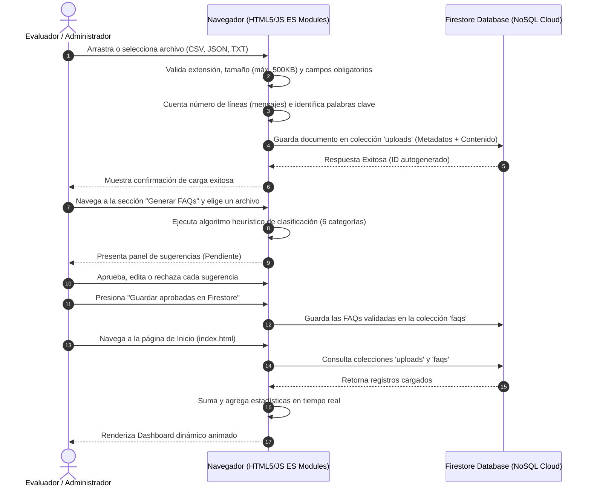

# Documentación Técnica: Everwood FAQ Cloud 🌲

Esta plataforma web cloud apoya el análisis y organización de conversaciones históricas (provenientes de canales como WhatsApp) de la empresa **Everwood**, con el propósito de identificar preguntas frecuentes (FAQs), clasificar las necesidades de los clientes y optimizar las respuestas de los agentes conversacionales.

---

## 🌐 Enlaces del Proyecto
- **URL de Despliegue Público (Firebase Hosting):** [https://everwood-faq-cloud-1cde3.web.app](https://everwood-faq-cloud-1cde3.web.app)
- **Repositorio Git:** [https://github.com/TU_USUARIO/Proyecto_Cloud](https://github.com/TU_USUARIO/Proyecto_Cloud)

---

## 🏗️ Diagrama de Arquitectura Cloud
La arquitectura se basa en un modelo **Serverless / No-Ops** que aprovecha el plan gratuito (Spark) de Google Firebase. Toda la lógica de negocio, parsing de archivos y clasificación heurística se ejecuta de forma segura en el cliente (navegador), eliminando la necesidad de servidores backend dedicados.

```mermaid
graph TD
    subgraph Cliente (Navegador)
        A[index.html - Dashboard] -->|Consulta Firestore| F1[(Firestore)]
        B[upload.html - Carga] -->|Extrae Metadatos| C[Analizador JS Local]
        C -->|Escribe Documentos| F1
        D[history.html - Historial] -->|Lista Cargas| F1
        E[faqs.html - Generador] -->|Heurística de Palabras Clave| G[Panel de Validación Humana]
        G -->|Escribe FAQs Aprobadas| F2[(Firestore - Colección faqs)]
    end

    subgraph Firebase Cloud Services
        Hosting[Firebase Hosting - URL Pública] -->|Sirve Código Estático| Cliente
        F1 -->|Colección: uploads| MetaData[Documentos: Metadatos + Archivo Completo]
        F2 -->|Colección: faqs| Aproved[Documentos: Preguntas Aprobadas]
    end
```

---

## 🔄 Flujo de Datos Técnico



---

## 📂 Estructura del Repositorio
```
Proyecto_Cloud/
├── public/                 # Directorio público servido por Hosting
│   ├── css/
│   │   └── styles.css      # Sistema de diseño global en Dark Mode
│   ├── js/
│   │   └── firebase-config.js # Configuración del cliente SDK Firebase
│   ├── index.html          # Landing y Dashboard de métricas real-time [MODIFICADO]
│   ├── upload.html         # Formulario de carga con analizador [MODIFICADO]
│   ├── history.html        # Historial de cargas con visor y descargas
│   ├── detail.html         # Detalle de metadatos individual de archivo
│   └── faqs.html           # Generador heurístico y panel de validación
├── samples/                # Carpeta de conversaciones de prueba [NUEVO]
│   ├── conversaciones_soporte.txt  # Muestra en formato TXT
│   ├── conversaciones_ventas.csv   # Muestra en formato CSV
│   └── conversaciones_horarios.json # Muestra en formato JSON
├── serve.ps1               # Servidor de desarrollo PowerShell nativo [NUEVO]
├── firebase.json           # Configuración del Firebase CLI
├── .firebaserc             # Alias del proyecto Cloud
└── README.md               # Resumen ejecutivo del repositorio
```

---

## 🛠️ Ejecución Local (Sin dependencias externas)

Si tu máquina no cuenta con Node.js/NPM o Python instalado, puedes ejecutar el servidor web local utilizando el script nativo de PowerShell provisto:

1. Abre la terminal de **PowerShell** en esta carpeta.
2. Ejecuta el siguiente comando para saltear políticas de seguridad de scripts temporales e iniciar el servidor:
   ```powershell
   powershell -ExecutionPolicy Bypass -File .\serve.ps1
   ```
3. Abre tu navegador favorito y accede a:
   👉 **[http://localhost:3000/](http://localhost:3000/)**
4. Para detener el servidor, presiona `Ctrl + C` en la consola de PowerShell.

---

## ⚙️ Reglas de Seguridad Base de Datos (Firestore)
Para fines académicos y de sustentación, la base de datos Firestore está configurada en **Modo de Prueba** (lectura y escritura abiertas a cualquiera):

```
rules_version = '2';
service cloud.firestore {
  match /databases/{database}/documents {
    match /{document=**} {
      allow read, write: if true;
    }
  }
}
```

---

## 🧑‍💻 Explicación del Algoritmo Heurístico de FAQs
El analizador local procesa el texto en el cliente realizando los siguientes pasos:
1. **Normalización:** Convierte el texto completo a minúsculas y elimina acentos y caracteres especiales.
2. **Tokenización:** Clasifica y agrupa palabras clave dentro de **6 categorías**:
   - 💰 **Precios:** `precio, costo, tarifa, descuento, gratis, etc.`
   - 🔧 **Soporte:** `problema, error, falla, no funciona, ayuda, soporte, etc.`
   - 🕐 **Horarios:** `horario, horas, disponible, abierto, cerrado, etc.`
   - 🔄 **Cancelaciones:** `cancelar, baja, anular, reembolso, devolución, etc.`
   - ⚙️ **Configuración:** `configurar, instalar, cuenta, registro, contraseña, etc.`
   - 🧑‍💼 **Atención:** `asesor, agente, humano, hablar, chat, teléfono, etc.`
3. **Generación Heurística:** Según el número de coincidencias detectadas por categoría (hits), asocia el tema más frecuente del chat (tópico principal) con plantillas dinámicas predefinidas, generando entre 1 y 3 sugerencias de preguntas por área de interés.
4. **Validación:** Permite la aprobación, descarte y edición libre antes de guardar en Firestore para mantener una curaduría limpia.
